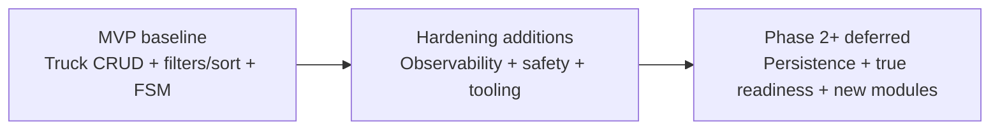

# Coldrun Analysis: Phase 2+, MVP Decisions, and Leftover Work

Last updated: 2026-05-27

## Documentation Context

- Documentation type: analysis document (architecture and delivery decisions)
- Target audience: developers (junior to senior), tech leads, reviewers
- Scope: Truck module MVP baseline, post-MVP hardening, deferred work
- Output location: docs/
- Existing docs used as source: docs/requirements.md, ../RUN.md, implementation files under src/ and tests/
- Format: Markdown
- Depth: comprehensive for MVP and immediate next phases
- Tone: formal, concise, implementation-grounded

## Discovery Summary (What Exists, What Is Missing, What Is Stale)

### Existing coverage

- Product requirements for first ERP module are defined in [docs/requirements.md](docs/requirements.md).
- Runtime and operations entry points are documented in [../RUN.md](../RUN.md).
- Public API behavior and constraints are implemented in truck endpoints, domain model, service, and transition policy.
- Unit tests cover truck entity validation and transition matrix logic.
- Seeder CLI supports data seeding and E2E-like scenario execution.

### Missing or not yet documented before this file

- A single, human-readable narrative explaining:
  - what was treated as MVP,
  - what was deliberately added beyond strict MVP,
  - why those decisions were made,
  - what remains deferred for Phase 2+.

### Potential staleness or mismatch signals

- Health checks include comments that Phase 2+ should replace in-memory readiness checks with database checks, but current implementation is still in-memory and always registered.
- Configuration includes a readiness DB-check toggle, but no corresponding conditional behavior is wired in startup code.

## Executive View

Coldrun delivered the Truck module MVP requested in requirements (CRUD + filtering/sorting + status transition rules), then added several production-readiness capabilities that are not strictly required by the original problem statement (rate limiting, correlation IDs, global exception mapping, request metrics, health endpoints, OpenAPI/Scalar UI, and seeder/E2E runner).

This means the current system is stronger than a bare coding exercise MVP, but it still intentionally stops short of persistence-backed readiness and multi-module ERP expansion.

## MVP Target (from requirements)

From [docs/requirements.md](docs/requirements.md), the explicit MVP target was:

- first ERP REST module for Trucks,
- full CRUD,
- filtered/sorted list querying,
- unique alphanumeric code,
- required name and status,
- optional description,
- strict status transition rules.

## MVP Delivered (implemented today)

- CRUD endpoints under /api/trucks: [src/Coldrun.Modules.Trucks/Endpoints/TruckEndpoints.cs](src/Coldrun.Modules.Trucks/Endpoints/TruckEndpoints.cs).
- Truck entity validation (code, name, status, description): [src/Coldrun.Modules.Trucks/Models/Truck.cs](src/Coldrun.Modules.Trucks/Models/Truck.cs).
- Transition policy enforcing allowed state changes: [src/Coldrun.Modules.Trucks/Policies/TruckStatusTransitionPolicy.cs](src/Coldrun.Modules.Trucks/Policies/TruckStatusTransitionPolicy.cs).
- Filtering and sorting in list operation: [src/Coldrun.Modules.Trucks/Services/TruckService.cs](src/Coldrun.Modules.Trucks/Services/TruckService.cs).
- In-memory storage with thread-safe access and atomic create uniqueness check: [src/Coldrun.Modules.Trucks/Services/InMemoryTruckStore.cs](src/Coldrun.Modules.Trucks/Services/InMemoryTruckStore.cs).

## MVP Decision Log (What and Why)

1. Decision: Use in-memory store for persistence in MVP.
Why: fastest path to deliver domain behavior and API contract without database setup overhead.
Evidence: store implementation and health-check comments in [src/Coldrun.Modules.Trucks/Services/InMemoryTruckStore.cs](src/Coldrun.Modules.Trucks/Services/InMemoryTruckStore.cs) and [src/Coldrun/HealthChecks/InMemoryStoreHealthCheck.cs](src/Coldrun/HealthChecks/InMemoryStoreHealthCheck.cs).

2. Decision: Keep status transition rules as explicit policy object.
Why: isolates finite-state-machine rules from endpoint concerns and makes rule evolution testable.
Evidence: [src/Coldrun.Modules.Trucks/Policies/TruckStatusTransitionPolicy.cs](src/Coldrun.Modules.Trucks/Policies/TruckStatusTransitionPolicy.cs).

3. Decision: Keep validation in domain entity methods (Create/Update).
Why: centralizes invariants and prevents endpoint/service drift in validation behavior.
Evidence: [src/Coldrun.Modules.Trucks/Models/Truck.cs](src/Coldrun.Modules.Trucks/Models/Truck.cs).

4. Decision: Enforce code uniqueness case-insensitively with atomic add.
Why: prevents concurrent check-then-act race when creating trucks.
Evidence: TryAdd method comments and lock scope in [src/Coldrun.Modules.Trucks/Services/InMemoryTruckStore.cs](src/Coldrun.Modules.Trucks/Services/InMemoryTruckStore.cs).

## Phase 2+ Analysis (Beyond Strict MVP)

The current implementation includes additional capabilities that are better categorized as Phase 2+ hardening rather than minimum feature delivery:

- Request correlation IDs for traceability:
  [src/Coldrun/Middleware/CorrelationIdMiddleware.cs](src/Coldrun/Middleware/CorrelationIdMiddleware.cs).
- Global exception middleware with consistent JSON error responses:
  [src/Coldrun/Middleware/GlobalExceptionMiddleware.cs](src/Coldrun/Middleware/GlobalExceptionMiddleware.cs).
- In-process request metrics endpoint at /metrics:
  [src/Coldrun/Middleware/RequestMetricsMiddleware.cs](src/Coldrun/Middleware/RequestMetricsMiddleware.cs).
- Rate limiting policy applied to truck endpoints:
  [src/Coldrun/Program.cs](src/Coldrun/Program.cs), [src/Coldrun/Configuration/RateLimitingOptions.cs](src/Coldrun/Configuration/RateLimitingOptions.cs).
- OpenAPI and interactive docs (Scalar):
  [src/Coldrun/Program.cs](src/Coldrun/Program.cs).
- Seeder CLI and scenario runner for repeatable setup and transition checks:
  [tools/Coldrun.Seeder/Program.cs](tools/Coldrun.Seeder/Program.cs), [tools/Coldrun.Seeder/Services/ScenarioRunner.cs](tools/Coldrun.Seeder/Services/ScenarioRunner.cs).

Why these likely were made:

- Improve operability and diagnostics early (correlation, metrics, health, structured errors).
- Make API easier to review and demo (OpenAPI + Scalar).
- Increase confidence in transition behavior without full integration-test infrastructure (scenario files + runner).
- Keep future migration path open (config scaffolding for modules and readiness behavior).

## Leftover Work (Deferred, Partial, or Not Yet Implemented)

This section is intentionally limited to items evidenced by current code/comments/config.

1. Persistence migration to a real database (Phase 2+ intent already noted in code comments).
- Evidence: [src/Coldrun/HealthChecks/InMemoryStoreHealthCheck.cs](src/Coldrun/HealthChecks/InMemoryStoreHealthCheck.cs).
- Current gap: all data is process-memory only.

2. True readiness check for database connectivity.
- Evidence: [src/Coldrun/Configuration/HealthChecksOptions.cs](src/Coldrun/Configuration/HealthChecksOptions.cs).
- Current gap: readiness toggle exists but startup does not wire DB readiness behavior; current check only validates in-memory accessibility.

3. Additional ERP modules (employees, factories, customers) are scaffolded conceptually only.
- Evidence: commented future module placeholders in [src/Coldrun/Configuration/ModuleOptions.cs](src/Coldrun/Configuration/ModuleOptions.cs).
- Current gap: no module implementation, endpoints, or domain logic beyond Trucks.

4. Endpoint-level automated tests are limited.
- Evidence: current test project focuses on domain and transition policy: [tests/Coldrun.Tests/TruckTests.cs](tests/Coldrun.Tests/TruckTests.cs), [tests/Coldrun.Tests/TruckStatusTransitionPolicyTests.cs](tests/Coldrun.Tests/TruckStatusTransitionPolicyTests.cs).
- Current gap: no direct API host integration tests in current test files.

5. Metrics durability/aggregation is intentionally local-process only.
- Evidence: static in-memory counters in [src/Coldrun/Middleware/RequestMetricsMiddleware.cs](src/Coldrun/Middleware/RequestMetricsMiddleware.cs).
- Current gap: counters reset on process restart, no external backend.

## Suggested Phase 2+ Delivery Order

1. Introduce durable persistence for trucks and replace in-memory store.
2. Implement real readiness DB check and honor readiness configuration toggle.
3. Add API integration tests for endpoint contracts and middleware behavior.
4. Keep seeder scenarios, but wire them into CI as optional E2E smoke tests.
5. Add next ERP module using the same modular pattern after persistence baseline is stable.

## Review Cadence

- Revisit this analysis after each major architecture shift (especially database migration and first non-Truck module).
- Minimum maintenance cadence: once per quarter or after any release that changes startup pipeline, module boundaries, or health/metrics behavior.
