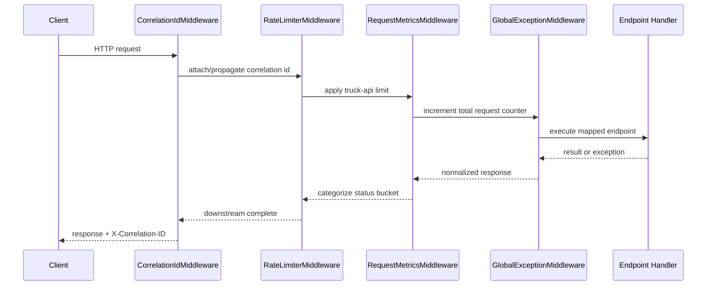
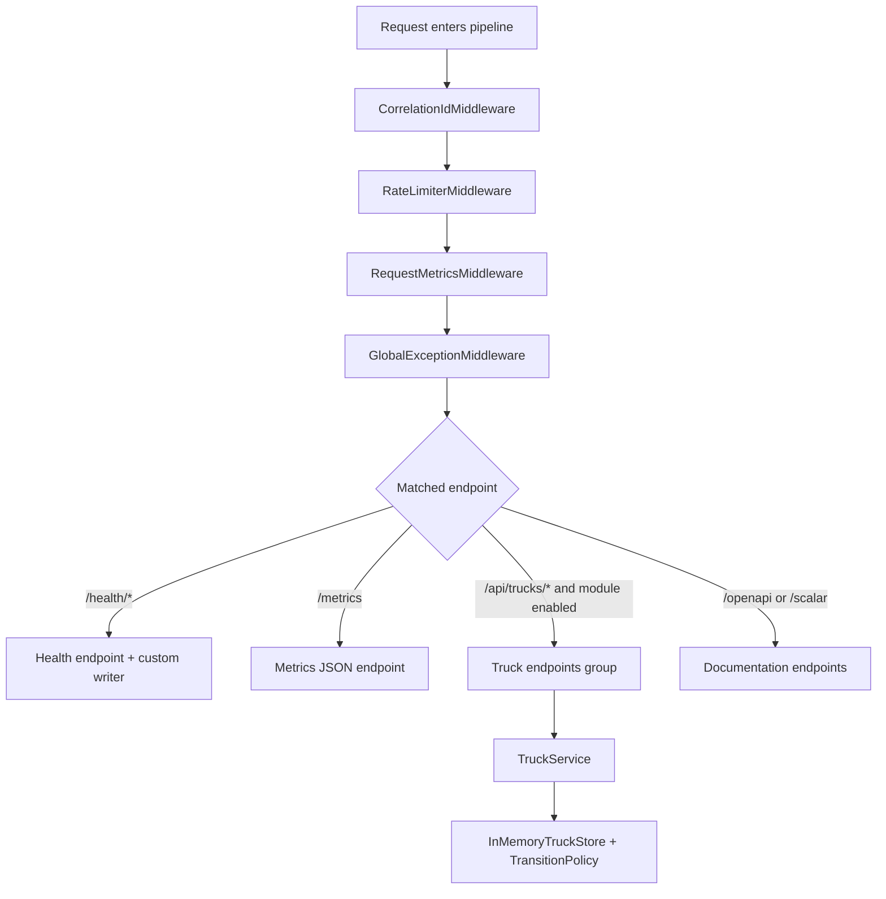
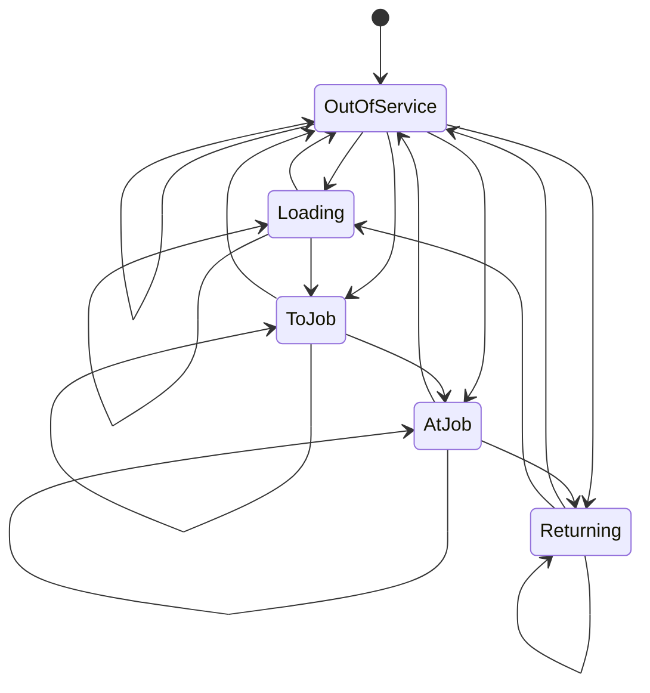
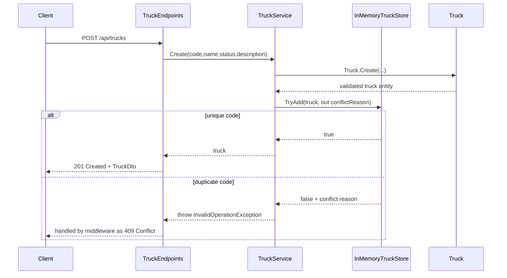
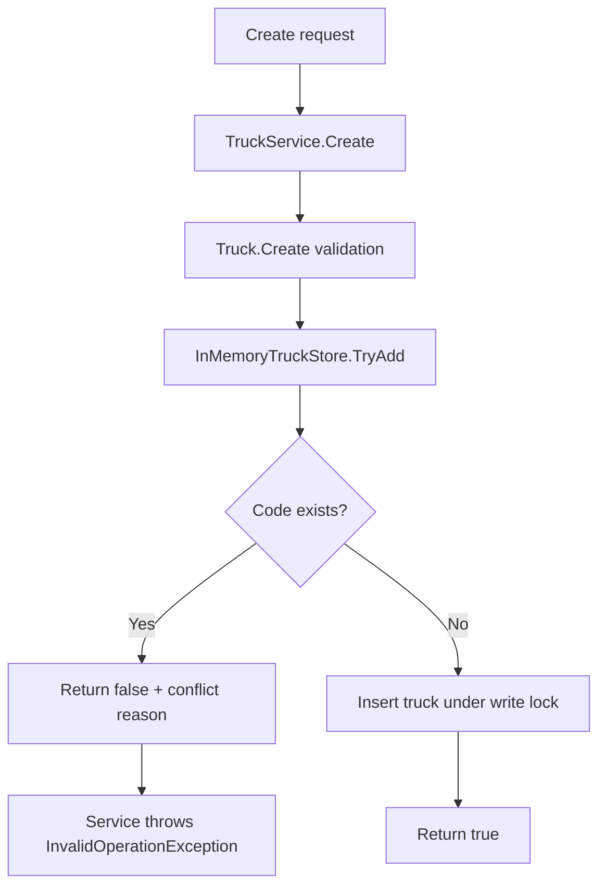
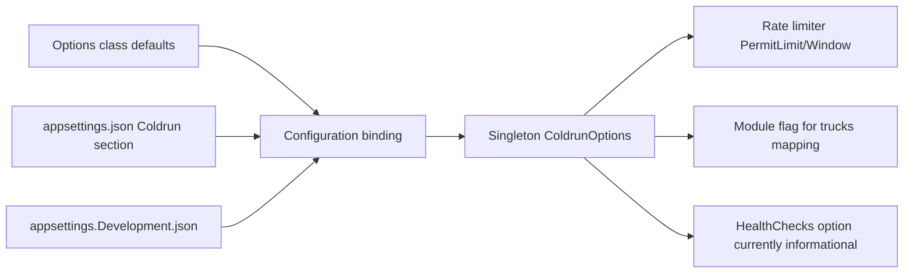
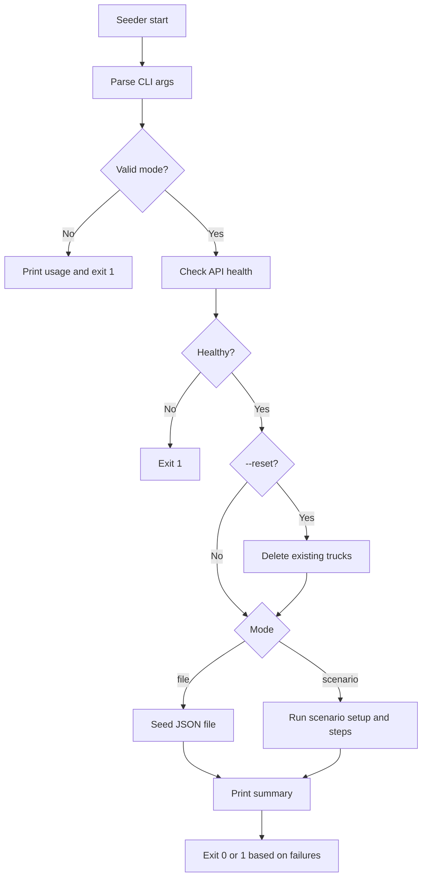
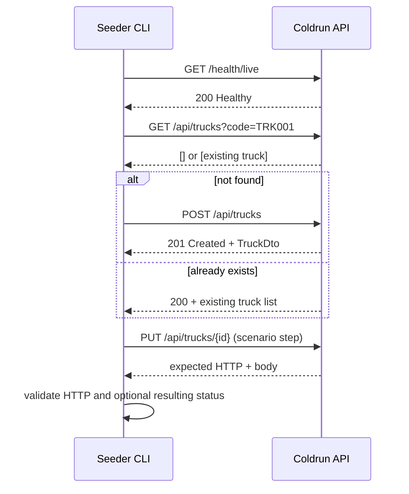

# Coldrun Current Implementation

Last updated: 2026-05-27

## Documentation Context

- Documentation type: implementation reference
- Target audience: backend developers, reviewers, operators
- Scope: current implementation in `src/`, `tests/`, and `tools/`
- Output location: `docs/current-implementation.md`
- Existing docs aligned: `RUN.md`, `docs/api-reference.md`, `docs/requirements.md`, `docs/analysis-phase2-plus-mvp-decisions.md`
- Format: Markdown + Mermaid
- Depth: comprehensive technical reference
- Tone: formal and implementation-grounded

## Discovery Summary

### Existing docs and their roles

- `RUN.md`: run/test/seed operations and command-level usage.
- `docs/api-reference.md`: endpoint contracts and examples.
- `docs/requirements.md`: original assignment scope.
- `docs/analysis-phase2-plus-mvp-decisions.md`: MVP vs deferred architecture decisions.

### Gaps this document covers

- Detailed startup and runtime wiring (DI lifetimes, middleware order, endpoint mapping conditions).
- Component interaction and request-flow diagrams for core API and seeder flows.
- Explicit technical-spec tables for configuration and error mapping.

### Staleness risks to monitor

- `Coldrun:HealthChecks:EnableReadinessDbCheck` is configured but not used in startup branching.
- Persistence and metrics remain in-memory and process-local.

## Solution Topology

Coldrun is a .NET 10 Minimal API composed as a host plus module architecture.

- Host: `src/Coldrun`
- Trucks module: `src/Coldrun.Modules.Trucks`
- Tests: `tests/Coldrun.Tests`
- Seeder CLI: `tools/Coldrun.Seeder`

```mermaid
flowchart LR
  Client[Client / Seeder CLI] --> Host[Coldrun Host]
  Host --> Pipeline[Middleware Pipeline]
  Pipeline --> TruckGroup[/api/trucks endpoint group]
  TruckGroup --> Service[TruckService singleton]
  Service --> Policy[TruckStatusTransitionPolicy singleton]
  Service --> Store[InMemoryTruckStore singleton]
  Host --> Health[/health/live and /health/ready]
  Host --> Metrics[/metrics]
  Host --> OpenApi[/openapi/v1.json]
  Host --> Scalar[/scalar/v1]
```

## Startup And Dependency Wiring

Startup composition is in `src/Coldrun/Program.cs`.

### Dependency registration

| Area | Registration | Lifetime | Notes |
|---|---|---|---|
| Config | `ColdrunOptions` bound from `Coldrun` section | Singleton | AOT-safe direct binding (no `IOptions<T>` reflection path used) |
| Rate limiting | Policy `truck-api` via `AddRateLimiter` | N/A | Fixed window limiter, partitioned by `RemoteIpAddress` string |
| Health checks | `AddCheck<InMemoryStoreHealthCheck>("inmemorystore")` | Managed by health checks | Used by both liveness and readiness endpoints |
| Trucks store | `InMemoryTruckStore` | Singleton | Shared in-memory repository |
| Transition policy | `TruckStatusTransitionPolicy` | Singleton | Pure policy object |
| Trucks service | `TruckService` | Singleton | Orchestrates validation, store operations, and policy checks |
| OpenAPI | `AddOpenApi()` | N/A | Generates OpenAPI document |

### Middleware and endpoint mapping order

1. `UseCorrelationId()`
2. `UseRateLimiter()`
3. `UseRequestMetrics()`
4. `UseGlobalExceptionHandling()`
5. `UseRouting()`
6. `MapHealthChecks("/health/live")`
7. `MapHealthChecks("/health/ready")`
8. `MapGet("/metrics")`
9. `MapTruckEndpoints()` only when `Coldrun:Modules:Trucks:Enabled=true`
10. `MapOpenApi()` and `MapScalarApiReference(...)`



### Request execution and branch behavior

| Concern | Current behavior | Implementation detail |
|---|---|---|
| Correlation propagation | Inbound `X-Correlation-ID` is reused; otherwise generated | Stored in `HttpContext.Items["X-Correlation-ID"]` and added to response header before response starts |
| Rate-limit partition key | Per remote IP address | Uses `httpContext.Connection.RemoteIpAddress?.ToString() ?? "unknown"` |
| Pipeline ordering | Metrics and exceptions are middleware-based, not endpoint filters | `UseRequestMetrics()` runs before `UseGlobalExceptionHandling()`, so all requests are counted even on failures |
| Endpoint branch | Trucks endpoints are conditional | `MapTruckEndpoints()` executes only when `Coldrun:Modules:Trucks:Enabled=true` |
| Anonymous access | Health, metrics, and docs endpoints are always anonymous | Explicit `AllowAnonymous()` on health and metrics mappings |



## Trucks Module Technical Specification

### Domain invariants

`Truck` (`src/Coldrun.Modules.Trucks/Models/Truck.cs`) enforces:

- Required fields: `Code`, `Name`, `Status`
- Optional field: `Description`
- `Code` rule: alphanumeric only (`A-Z`, `a-z`, `0-9`)
- Allowed statuses (ordinal matching):
  - Out Of Service
  - Loading
  - To Job
  - At Job
  - Returning

### State transition policy

`TruckStatusTransitionPolicy` (`src/Coldrun.Modules.Trucks/Policies/TruckStatusTransitionPolicy.cs`) validates transitions via a fixed matrix.

| Current | Allowed Next |
|---|---|
| Out Of Service | Out Of Service, Loading, To Job, At Job, Returning |
| Loading | Loading, Out Of Service, To Job |
| To Job | Out Of Service, To Job, At Job |
| At Job | Out Of Service, At Job, Returning |
| Returning | Loading, Out Of Service, Returning |



### Service behavior

`TruckService` (`src/Coldrun.Modules.Trucks/Services/TruckService.cs`) responsibilities:

- `Create`: validates domain rules, then uses store `TryAdd` for atomic uniqueness check.
- `GetById`: direct store lookup.
- `List`: optional filters (`code`, `name`, `status`) and sorting (`code|name|status`, `asc|desc`).
- `Update`: validates existence, uniqueness conflict against other IDs, then applies transition-aware update.
- `Delete`: deletes by ID and returns boolean outcome.

### Endpoint contract map

`TruckEndpoints` (`src/Coldrun.Modules.Trucks/Endpoints/TruckEndpoints.cs`) maps all endpoints under `/api/trucks`, with `RequireRateLimiting("truck-api")`.

| Method | Route | Handler | Success | Primary error cases |
|---|---|---|---|---|
| POST | `/api/trucks/` | `CreateTruck` | `201 Created` | `400`, `409` |
| GET | `/api/trucks/{id:guid}` | `GetTruck` | `200 OK` | `404` |
| GET | `/api/trucks/` | `ListTrucks` | `200 OK` | `400` via middleware if invalid query values trigger service/domain exceptions |
| PUT | `/api/trucks/{id:guid}` | `UpdateTruck` | `200 OK` | `400`, `404`, `409` |
| DELETE | `/api/trucks/{id:guid}` | `DeleteTruck` | `204 No Content` | `404` |

### Trucks request/response contract detail

#### Request DTOs

| DTO | Required fields | Optional fields | Notes |
|---|---|---|---|
| `TruckCreateRequest` | `Code`, `Name`, `Status` | `Description` | Used by `POST /api/trucks` |
| `TruckUpdateRequest` | `Code`, `Name`, `Status` | `Description` | Used by `PUT /api/trucks/{id}` |
| `TruckListRequest` | none | `Code`, `Name`, `Status`, `SortBy`, `SortDir` | Bound via `[AsParameters]` from query string |

#### List filtering and sorting semantics

| Parameter | Matching rule | Case handling | Fallback behavior |
|---|---|---|---|
| `code` | `Contains` on truck code | case-insensitive | no filter when null/whitespace |
| `name` | `Contains` on truck name | case-insensitive | no filter when null/whitespace |
| `status` | exact string equality | case-insensitive | no filter when null/whitespace |
| `sortBy` | `code`, `name`, `status` | normalized with `ToLowerInvariant()` | unknown value falls back to `code` ascending |
| `sortDir` | `asc` or `desc` intent | compared case-insensitively | any value other than `desc` sorts ascending |



## In-Memory Store And Concurrency

`InMemoryTruckStore` (`src/Coldrun.Modules.Trucks/Services/InMemoryTruckStore.cs`) implementation characteristics:

- Shared mutable list protected by `ReaderWriterLockSlim`.
- Read operations (`GetById`, `GetByCode`, `ExistsByCode`, `GetAll`) acquire read lock.
- Write operations (`TryAdd`, `Update`, `Delete`) acquire write lock.
- `TryAdd` performs uniqueness check and insert in one write lock scope, preventing check-then-act races.
- `GetAll` returns a snapshot copy (`[.. _trucks]`) to avoid exposing internal list instance.



## Cross-Cutting Technical Behavior

### Correlation ID middleware

`CorrelationIdMiddleware` (`src/Coldrun/Middleware/CorrelationIdMiddleware.cs`):

- Header name: `X-Correlation-ID`
- Uses inbound header when present.
- Otherwise uses `Activity.Current.TraceId` if available; else generates `Guid.NewGuid().ToString("N")`.
- Stores ID in `HttpContext.Items["X-Correlation-ID"]`.
- Logs request start/end with method, path, status, elapsed ms, and correlation ID.
- Adds response header if `Response.HasStarted == false`.

### Global exception middleware

`GlobalExceptionMiddleware` (`src/Coldrun/Middleware/GlobalExceptionMiddleware.cs`) maps exceptions to responses:

| Exception pattern | HTTP status | Message source |
|---|---|---|
| `ArgumentException` | `400 Bad Request` | exception message |
| `InvalidOperationException` containing `already exists` | `409 Conflict` | exception message |
| `InvalidOperationException` containing `not found` | `404 Not Found` | exception message |
| Other `InvalidOperationException` | `400 Bad Request` | exception message |
| Other exceptions | `500 Internal Server Error` | detailed in Development, generic otherwise |

Response body shape:

```json
{ "error": "message" }
```

```mermaid
flowchart TD
  A[Exception caught by GlobalExceptionMiddleware] --> B{Exception type}
  B -->|ArgumentException| C[400 Bad Request]
  B -->|InvalidOperationException + 'already exists'| D[409 Conflict]
  B -->|InvalidOperationException + 'not found'| E[404 Not Found]
  B -->|Other InvalidOperationException| F[400 Bad Request]
  B -->|Other exception| G{Environment}
  G -->|Development| H[500 with exception type + message]
  G -->|Non-development| I[500 with generic message]
  C --> J[Write JSON { error }]
  D --> J
  E --> J
  F --> J
  H --> J
  I --> J
```

### Request metrics middleware

`RequestMetricsMiddleware` (`src/Coldrun/Middleware/RequestMetricsMiddleware.cs`):

- Global counters stored in static memory.
- Uses `Interlocked` operations for atomic counter updates.
- Uses `ConcurrentDictionary<string, AtomicCounter>` for endpoint and status category buckets.
- Endpoint bucket key: `context.GetEndpoint()?.DisplayName ?? "Unknown"`.
- Status buckets: `Success`, `Redirect`, `ClientError`, `ServerError`, `Unknown`.
- Exposed via `GET /metrics` (JSON text response).

Metrics payload contract:

| Field | Type | Source | Meaning |
|---|---|---|---|
| `totalRequests` | number | atomic static counter | Total requests seen by middleware since process start/reset |
| `requestsByEndpoint` | object map `<string, number>` | endpoint display name | Counts per resolved endpoint display name |
| `requestsByStatusCategory` | object map `<string, number>` | response status mapping | Counts grouped as `Success`, `Redirect`, `ClientError`, `ServerError`, `Unknown` |

## Health, OpenAPI, and Scalar

### Health endpoints

- `GET /health/live`
- `GET /health/ready`

Both use a shared response writer in `Program.cs` with payload:

```json
{
  "status": "Healthy",
  "correlationId": "...",
  "checks": [
    { "name": "inmemorystore", "status": "Healthy" }
  ]
}
```

`InMemoryStoreHealthCheck` currently validates in-memory store accessibility by calling `_store.GetAll().Count`.

### API contract discovery

- `GET /openapi/v1.json`
- `GET /scalar/v1`

## Configuration Contract And Runtime Effects

Source: `src/Coldrun/appsettings.json` and options classes in `src/Coldrun/Configuration/`.

| Key | Type | Default | Runtime effect |
|---|---|---|---|
| `Coldrun:RateLimiting:PermitLimit` | int | `100` | Requests allowed per fixed window in `truck-api` policy |
| `Coldrun:RateLimiting:WindowMinutes` | int | `1` | Fixed-window duration for `truck-api` policy |
| `Coldrun:HealthChecks:EnableReadinessDbCheck` | bool | `false` | Currently no startup branching uses this value |
| `Coldrun:Modules:Trucks:Enabled` | bool | `true` | Controls whether truck endpoints are mapped |

### Configuration precedence and binding notes

1. Defaults are defined in options classes (`RateLimitingOptions`, `HealthChecksOptions`, `TruckModuleOptions`).
2. `appsettings.json` overrides those defaults when keys are present.
3. Environment-specific file (`appsettings.Development.json`) currently does not override `Coldrun` keys.
4. The bound `ColdrunOptions` instance is registered as a singleton and read directly in startup.



## Tooling: Seeder And Scenario Runner

`tools/Coldrun.Seeder` supports two mutually exclusive execution modes:

- `--file <json>` for data seeding
- `--scenario <json>` for E2E-like scenario execution

Additional behavior:

- Optional `--reset` deletes all existing trucks before execution.
- Base URL default: `http://localhost:5000`.
- `COLDRUN_API_URL` environment variable overrides base URL when set.
- Non-zero process exit code on validation or execution failures.



### Seeder HTTP interaction specification

| Operation | Endpoint(s) called | Success condition | Failure handling |
|---|---|---|---|
| Health probe | `GET /health/live` | any 2xx | returns non-zero exit when unavailable |
| Reset | `GET /api/trucks`, then `DELETE /api/trucks/{id}` per item | delete returns success per truck | logs individual delete failures |
| Seed existence check | `GET /api/trucks?code={code}` | list response parsed | HTTP failure increments failed counter |
| Seed create | `POST /api/trucks` | 2xx/201 create response | increments failed and prints parsed `error` field when present |
| Scenario setup | `GET /api/trucks?code={code}`, fallback `POST /api/trucks` | existing or created truck context stored | missing setup truck causes downstream step failure |
| Scenario step | `PUT /api/trucks/{id}` with full body | expected HTTP code and optional expected response `status` | records per-step mismatch details |



## Test Coverage Snapshot

Current tests emphasize domain and policy correctness:

- `tests/Coldrun.Tests/TruckTests.cs`
  - Creation validation (required fields, alphanumeric code, allowed statuses)
  - Update validation and transition enforcement
  - Same-status updates allowed
- `tests/Coldrun.Tests/TruckStatusTransitionPolicyTests.cs`
  - Transition matrix coverage by current status
  - Full cycle validation (`Loading -> To Job -> At Job -> Returning -> Loading`)
  - Invalid-direction and guard-clause tests

No API-host integration tests are present in the current test project.

Additional coverage observations:

- No automated tests currently validate middleware behavior (`CorrelationId`, `GlobalException`, `RequestMetrics`) end-to-end.
- No explicit concurrency stress tests target `InMemoryTruckStore` write/read lock behavior.
- No tests currently validate startup branch behavior when `Coldrun:Modules:Trucks:Enabled=false`.

## Known Constraints

- In-memory persistence only; all data resets on process restart.
- Metrics are process-local and non-durable.
- Readiness DB-check option exists but is not yet wired into startup behavior.
- No authentication or authorization in current API surface.

## Review Cadence

Review this document after any of the following:

- startup pipeline or DI changes in `src/Coldrun/Program.cs`
- endpoint/contract changes in trucks module
- persistence or health-check redesign
- observability behavior changes (metrics/correlation/exception mapping)
